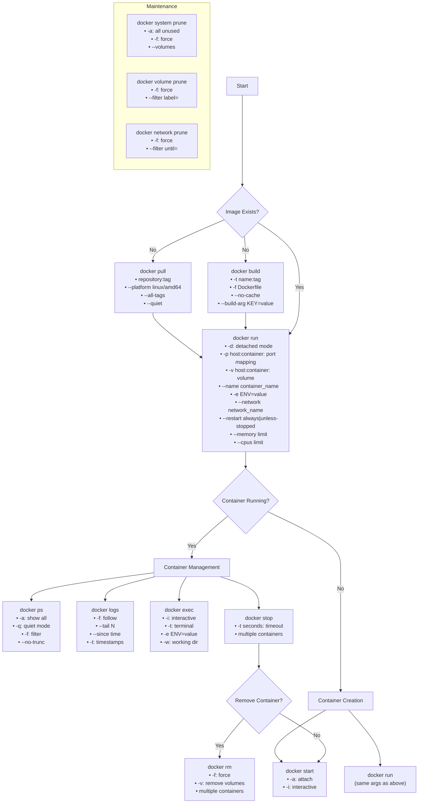

# Docker Commands Flowchart

```mermaid
flowchart TD
    A[Start] --> B{Image Exists?}
    B -->|No| C["docker pull 
    • repository:tag
    • --platform linux/amd64
    • --all-tags
    • --quiet"]
    B -->|No| D["docker build
    • -t name:tag
    • -f Dockerfile
    • --no-cache
    • --build-arg KEY=value"]
    C --> E["docker run
    • -d: detached mode
    • -p host:container: port mapping
    • -v host:container: volume
    • --name container_name
    • -e ENV=value
    • --network network_name
    • --restart always|unless-stopped
    • --memory limit
    • --cpus limit"]
    D --> E
    B -->|Yes| E
    
    E --> F{Container Running?}
    F -->|Yes| G[Container Management]
    F -->|No| H[Container Creation]
    
    G --> I["docker ps
    • -a: show all
    • -q: quiet mode
    • -f: filter
    • --no-trunc"]
    G --> J["docker logs
    • -f: follow
    • --tail N
    • --since time
    • -t: timestamps"]
    G --> K["docker exec
    • -i: interactive
    • -t: terminal
    • -e ENV=value
    • -w: working dir"]
    G --> L["docker stop
    • -t seconds: timeout
    • multiple containers"]
    
    H --> M["docker run
    (same args as above)"]
    H --> N["docker start
    • -a: attach
    • -i: interactive"]
    
    L --> O{Remove Container?}
    O -->|Yes| P["docker rm
    • -f: force
    • -v: remove volumes
    • multiple containers"]
    O -->|No| N
    
    subgraph "Maintenance"
    Q["docker system prune
    • -a: all unused
    • -f: force
    • --volumes"]
    R["docker volume prune
    • -f: force
    • --filter label="]
    S["docker network prune
    • -f: force
    • --filter until="]
    end
```